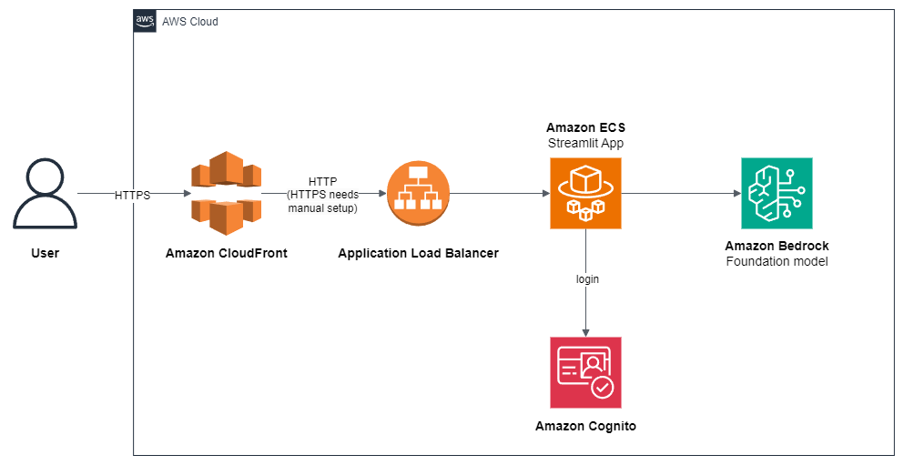

# deploy-streamlit-app

This app can be used as a starting point to easily create and deploy a GenAI demo, with web interface and user authentication. It is written in python only, with cdk template to deploy on AWS.

It deploys a basic Streamlit app, and contains the following components:

* The Streamlit app in ECS/Fargate, behind an ALB and CloudFront
* A Cognito user pool in which you can manage users

By default, the Streamlit app has the following features:

* Authentication through Cognito
* Connection to Bedrock 

## Architecture diagram



## Usage

In the docker_app folder, you will find the streamlit app. You can run it locally or with docker.

Note: for the docker version to run, you will need to give appropriate permissions to the container for bedrock access. This is not implemented yet.

In the main folder, you will find a cdk template to deploy the app on ECS / ALB.

Prerequisites:

* python >= 3.8
* docker
* use a Chrome browser for development
* `anthropic.claude-v2` model activated in Amazon Bedrock in your AWS account
* the environment used to create this demo was an AWS Cloud9 m5.large instance with Amazon Linux 2023, but it should also work with other configurations. It has also been tested on a mac laptop with colima as container runtime.
* You also need to install the AWS Command Line Interface (CLI), the AWS Cloud Development KIT (CDK), and to configure the AWS CLI on your development environment (not required if you use Cloud9, as it is already configured by default). One way to configure the AWS CLI is to get your access key through the AWS console, and use the `aws configure` command in your terminal to setup your credentials.

To deploy:

1. Edit `docker_app/config_file.py`, choose a `STACK_NAME` and a `CUSTOM_HEADER_VALUE`.

2. Install dependencies
 
```
python -m venv .venv
source .venv/bin/activate
pip install -r requirements.txt
```

3. Deploy the cdk template

```
cdk bootstrap
cdk deploy
```

The deployment takes 5 to 10 minutes.

Make a note of the output, in which you will find the CloudFront distribution URL
and the Cognito user pool id.

4. Create a user in the Cognito UserPool that has been created. You can perform this action from your AWS Console. 
5. From your browser, connect to the CloudFront distribution url.
6. Log in to the Streamlit app with the user you have created in Cognito.

## Testing and developing in Cloud9

After deployment of the cdk template containing the Cognito user pool required for authentication, you can test the Streamlit app directly from Cloud9.
You can either use docker, but this would require setting up a role with appropriate permissions, or run the Streamlit app directly in your terminal after having installed the required python dependencies.

To run the Streamlit app directly:

1. If you have activated a virtual env for deploying the cdk template, deactivate it:

```
deactivate
```

2. cd into the streamlit-docker directory, create a new virtual env, and install dependencies:

```
cd docker_app
python -m venv .venv
source .venv/bin/activate
pip install -r requirements.txt
```

3. Launch the streamlit server

```
streamlit run app.py --server.port 8080
```

4. Click on the Preview/Preview running application button in Cloud9, and click on the button to Pop out the browser in a new window, as the Cloud9 embedded browser does not keep session cookies, which prevents the authentication mechanism to work properly.
If the new window does not display the app, you may need to configure your browser to accept cross-site tracking cookies.

5. You can now modify the streamlit app to build your own demo!

## Some limitations

* The connection between CloudFront and the ALB is in HTTP, not SSL encrypted.
This means traffic between CloudFront and the ALB is unencrypted.
It is **strongly recommended** to configure HTTPS by bringing your own domain name and SSL/TLS certificate to the ALB.
* The provided code is intended as a demo and starting point, not production ready.
The Python app relies on third party libraries like Streamlit and streamlit-cognito-auth.
As the developer, it is your responsibility to properly vet, maintain, and test all third party dependencies.
The authentication and authorization mechanisms in particular should be thoroughly evaluated.
More generally, you should perform security reviews and testing before incorporating this demo code in a production application or with sensitive data.
* In this demo, Amazon Cognito is in a simple configuration.
Note that Amazon Cognito user pools can be configured to enforce strong password policies,
enable multi-factor authentication,
and set the AdvancedSecurityMode to ENFORCED to enable the system to detect and act upon malicious sign-in attempts.
* AWS provides various services, not implemented in this demo, that can improve the security of this application.
Network security services like network ACLs and AWS WAF can control access to resources.
You could also use AWS Shield for DDoS protection and Amazon GuardDuty for threats detection.
Amazon Inspector performs security assessments.
There are many more AWS services and best practices that can enhance security -
refer to the AWS Shared Responsibility Model and security best practices guidance for additional recommendations.
The developer is responsible for properly implementing and configuring these services to meet their specific security requirements.
* Regular rotation of secrets is recommended, not implemented in this demo.

## Acknowledgments

This code is inspired from:

* https://github.com/tzaffi/streamlit-cdk-fargate.git
* https://github.com/aws-samples/build-scale-generative-ai-applications-with-amazon-bedrock-workshop/

## Security

See [CONTRIBUTING](CONTRIBUTING.md#security-issue-notifications) for more information.

## License

This application is licensed under the MIT-0 License. See the LICENSE file.

# life-graph-llm — Local development guide

Quick instructions to get this project running locally for development.

## Prerequisites
- Python 3.9+ (or your project's supported Python version)
- git
- (Optional) AWS CLI configured if you want to use AWS credentials from your environment

## Setup (recommended)
1. Clone the repo
   - git clone <repo-url> /path/to/life-graph-llm
   - cd /Users/derek/Documents/Misc/life-graph-llm

2. Create and activate a virtual environment
   - python3 -m venv .venv
   - source .venv/bin/activate  (Linux / macOS)
   - .venv\Scripts\activate     (Windows PowerShell)

3. Install dependencies
   - pip install -r requirements-dev.txt

4. Add secrets (do NOT commit)
   - Create a `.env` file or set environment variables in your shell:
     - TWITTER_BEARER_TOKEN or provide the token in the app sidebar
     - FACEBOOK_ACCESS_TOKEN or provide the token in the app sidebar
     - AWS credentials (if using Bedrock via boto3):
       - AWS_ACCESS_KEY_ID
       - AWS_SECRET_ACCESS_KEY
       - AWS_SESSION_TOKEN (optional)
     - BEDROCK region used in code: set `Config.BEDROCK_REGION` in `config_file.py` or export an env var used by your config.

   Notes:
   - The app can accept tokens via the sidebar inputs during runtime; storing them in your environment is more convenient for repeated testing.
   - Never commit tokens or secrets to version control.

## Run the Streamlit app
- Main page (Twitter / Facebook / LLM form):
  - streamlit run docker_app/pages/1_Generate_json_Twitter.py
- Wikipedia / URL fetch page:
  - streamlit run docker_app/pages/2_Generate_json_URL.py
- Preview page:
  - streamlit run docker_app/pages/3_Life_Graph_Preview.py

Streamlit will start a local server (default http://localhost:8501). Hot reload is enabled — files saved will refresh the app automatically.

## Running the LLM locally
- The LLM client uses boto3 to call AWS Bedrock. If you have an AWS session token, either:
  - export AWS env vars (AWS_ACCESS_KEY_ID, AWS_SECRET_ACCESS_KEY, AWS_SESSION_TOKEN), or
  - pass tokens to the Llm constructor in code (not recommended for security).
- Check `utils/llm.py` for the current model id and message format.

## Working with Twitter / Facebook
- Twitter: provide a valid Bearer Token (v2 API) in the sidebar to fetch tweets. If you get empty results or errors, tokens may be expired or the account may be private. The app will display helpful error messages in the sidebar.
- Facebook: provide a long-lived access token with the required permissions for reading the feed. The app follows paging to gather the requested number of posts.

## Debugging & tests
- Basic tests can be run with pytest (if tests are present):
  - pytest
- Use `print()` or `st.write()` for quick inspection in Streamlit.
- Check the console output where Streamlit runs for stack traces.

## Notes & security
- Keep all tokens and credentials out of source control. Use `.gitignore` to ignore `.env` and any local secret files.
- For production or shared environments, use a secret manager (AWS Secrets Manager, HashiCorp Vault, etc.).

## Helpful commands
- Activate venv: `source .venv/bin/activate`
- Install deps: `pip install -r requirements-dev.txt`
- Run app: `streamlit run docker_app/pages/1_Generate_json_Twitter.py`
- Install a new package: `pip install <pkg> && pip freeze > requirements-dev.txt`

That's it — the app should now run locally. If you need additional onboarding content (architecture diagram, component map, or env examples), say which format you prefer.